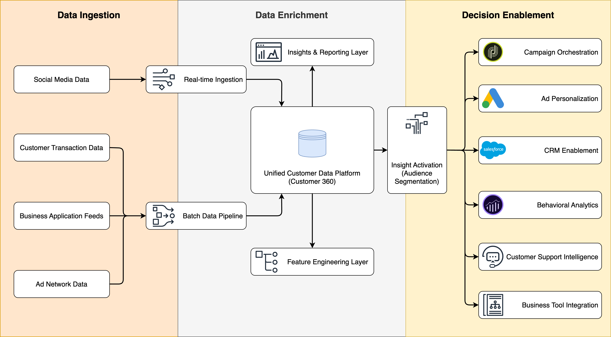

# RFMP Segmentation with NLP-Based Product Categorization

Customer segmentation is a cornerstone of personalized marketing, yet most segmentation models assume structured product hierarchies. This project enhances traditional RFM segmentation by incorporating **Product** affinity (RFMP), using NLP to infer product categories from noisy product descriptions.

We’ll walk through a practical pipeline that:

- Prepares retail transaction data
- Extracts semantic meaning from free-text product names
- Clusters products into meaningful categories using ML
- Performs RFMP segmentation for downstream personalization

---

## Overall Workflow of E2E RFMP Segmentation



## 💡 Why RFMP?

Traditional **RFM** segmentation (Recency, Frequency, Monetary value) provides a lightweight yet powerful view into customer behavior. By extending it with **Product preferences (P)**, we can gain insights into what customers buy, not just how often or how recently they buy. This empowers:

- Category-specific campaigns
- Personalized recommendations
- Product lifecycle analysis

---

## 📦 What's Inside

- 🧹 `01-data-preparation.py`  
  Clean, preprocess, and vectorize product names using NLP

- 🤖 `02-exploratory-data-analysis.py`  
  Cluster products into interpretable categories using embeddings + KMeans

- 📊 `03-rfmp-segmentation.py`  
  Compute Recency, Frequency, Monetary value, and Product preference

- 📈 `04-analysis-and-visualization.py`  
  Visualize customer segments and top categories

---

## 🚀 Getting Started

To use this solution locally or in a cloud notebook environment (Databricks, Colab, etc.):

1. Clone the repository:
   ```bash
   git clone https://github.com/your-org/rfmp-segmentation-with-nlp-categorization.git
   ```
